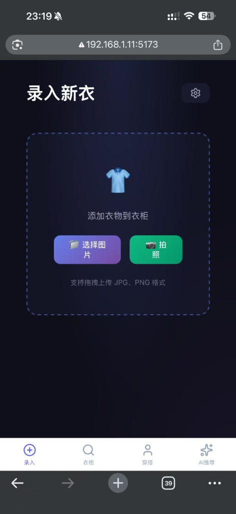
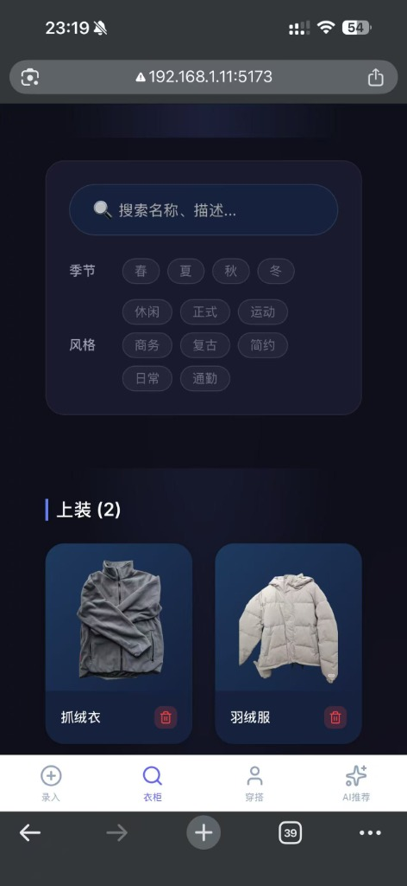
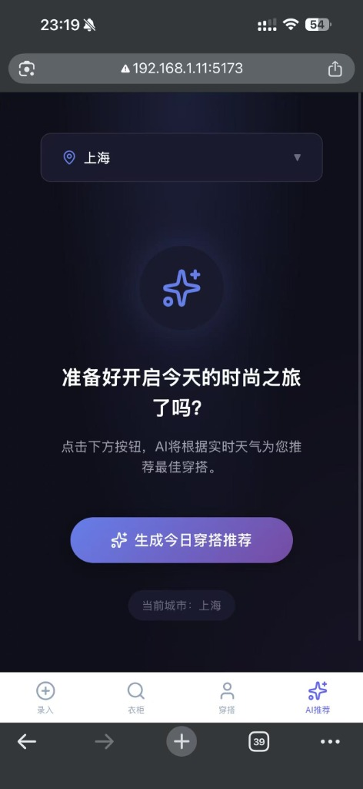
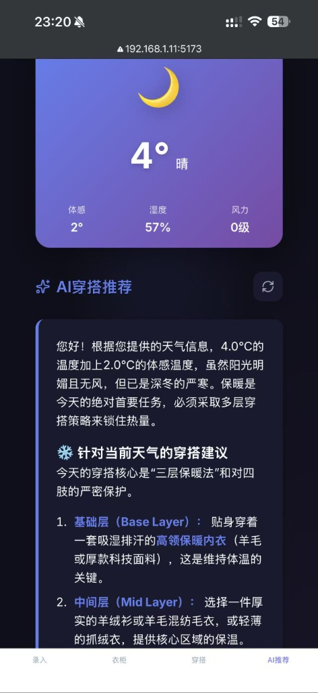
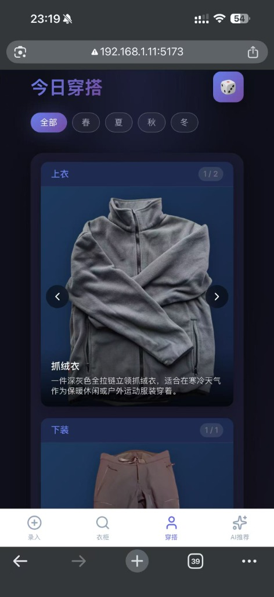

<div align="center">
  <h1>👕 AI Smart Wardrobe</h1>
  <p>
    <strong>Your Personal AI Stylist & Wardrobe Manager</strong>
  </p>
  <p>
     基于 AI 的个人智能衣柜管理系统。上传衣服照片，自动去背景、识别分类，并根据当地天气提供每日穿搭建议。
  </p>

  <!-- Badges -->
  <p>
    <a href="https://github.com/leoz9/AIWardrobe/graphs/contributors">
      
    </a>
    <a href="">
      
    </a>
    <a href="https://github.com/leoz9/AIWardrobe/network/members">
      
    </a>
    <a href="https://github.com/leoz9/AIWardrobe/stargazers">
      
    </a>
    <a href="https://github.com/leoz9/AIWardrobe/issues/">
      
    </a>
    <a href="https://github.com/leoz9/AIWardrobe/blob/master/LICENSE">
      
    </a>
  </p>
</div>

---

## 📖 简介 (Introduction)

**AI Smart Wardrobe** 是一个现代化的智能衣柜解决方案。它结合了计算机视觉和大型语言模型（LLM）的力量，为您提供无缝的衣物管理和个性化的穿搭建议。无论是在匆忙的早晨，还是为特殊场合做准备，AI Wardrobe 都能助您一臂之力。

## ✨ 核心特性 (Features)

| 特性 | 描述 |
| :--- | :--- |
| 📸 **智能上传** | 上传衣服照片，利用 **rembg** 自动移除背景，并使用 **Gemini Vision** 智能识别服装类别、颜色和风格。 |
| 🌤️ **天气穿搭** | 集成 **和风天气 (QWeather) API**，实时获取当地天气数据，为您推荐最舒适、最时尚的穿搭组合。 |
| 👗 **虚拟衣柜** | 数字化您的衣橱，随时随地浏览、搜索和管理您的所有衣物。 |
| 🧠 **AI 推荐大模型** | 内置 **Gemini / OpenAI** 支持，生成符合时尚美学的搭配建议，像私人造型师一样懂您。 |
| 📱 **多端适配** | 采用响应式设计，在桌面端、平板和手机上都能获得极致体验。 |

## 👀 运行演示 (Demo)

> 💡 截图加载可能需要一些时间，请耐心等待。

<table align="center">
  <tr>
    <td align="center" width="33%">
      
      <br />
      <strong>📸 录入新衣</strong>
      <br />
      支持拍照和图库上传
    </td>
    <td align="center" width="33%">
      
      <br />
      <strong>👗 我的衣橱</strong>
      <br />
      智能分类与快速搜索
    </td>
    <td align="center" width="33%">
      
      <br />
      <strong>🤖 AI 推荐引导</strong>
      <br />
      一键开启时尚之旅
    </td>
  </tr>
  <tr>
    <td align="center" width="33%">
      
      <br />
      <strong>🌤️ 智能穿搭建议</strong>
      <br />
      结合天气与美学的完美推荐
    </td>
    <td align="center" width="33%">
      
      <br />
      <strong>✨ 穿搭详情</strong>
      <br />
      高清细节展示
    </td>
    <td align="center" width="33%">
    </td>
  </tr>
</table>

## 🛠️ 技术栈 (Tech Stack)

### Frontend


### Backend & AI


## 🚀 快速开始 (Getting Started)

### 前置要求 (Prerequisites)
*   **Node.js**: v18+
*   **Python**: v3.10+
*   **API Keys**:
    *   [Google Gemini API Key](https://aistudio.google.com/app/apikey) 或 OpenAI Key
    *   [和风天气 API Key](https://console.qweather.com)

### 1. 克隆项目
```bash
git clone https://github.com/leoz9/AIWardrobe.git
cd AIWardrobe
```

### 2. 环境配置

在 `backend` 目录下创建 `.env` 文件：
```bash
cd backend
cp .env.example .env
# 编辑 .env 文件，填入您的 API Key 和其他配置
```

### 3. 安装依赖

**后端 (Backend)**
```bash
cd backend
python -m venv venv
# 激活虚拟环境:
# Windows: venv\Scripts\activate
# Mac/Linux: source venv/bin/activate

pip install -r requirements.txt
```

**前端 (Frontend)**
```bash
cd ../frontend
npm install
```

### 4. 一键启动 (Run)

我们在根目录提供了便捷的启动脚本：

**Mac / Linux:**
```bash
chmod +x start.sh
./start.sh
```

**Windows:**
双击 `start.bat` 或在命令行运行：
```cmd
start.bat
```

启动后访问：
*   🏠 **前端页面**: [http://localhost:5173](http://localhost:5173)
*   📄 **后端文档**: [http://localhost:8000/docs](http://localhost:8000/docs)

## 🐳 Docker 一键部署 (Docker Deployment)

如果您不想配置本地开发环境，可以直接使用 Docker 快速启动。

### 前置要求
- 安装 [Docker](https://www.docker.com/) 和 Docker Compose

### 部署步骤

1.  **配置环境变量**
    
    同本地开发一样，首先需要在 `backend` 目录下创建并配置 `.env` 文件：
    ```bash
    cd backend
    cp .env.example .env
    # 编辑 .env 填入 API Key
    ```

2.  **一键启动**
    
    在项目根目录下运行：
    ```bash
    docker-compose up -d --build
    ```

3.  **访问项目**
    
    启动完成后，直接访问：
    *   🏠 **Web 应用**: [http://localhost:8000](http://localhost:8000)
    *   📄 **API 文档**: [http://localhost:8000/docs](http://localhost:8000/docs)

    > ⚠️ **注意**: Docker 部署模式下，数据（数据库和上传图片）将持久化保存在 `backend/data` 和 `backend/uploads` 目录中。

## 📈 Star History

<a href="https://star-history.com/#leoz9/AIWardrobe&Date">
 <picture>
   <source media="(prefers-color-scheme: dark)" srcset="https://api.star-history.com/svg?repos=leoz9/AIWardrobe&type=Date&theme=dark" />
   <source media="(prefers-color-scheme: light)" srcset="https://api.star-history.com/svg?repos=leoz9/AIWardrobe&type=Date" />
   
 </picture>
</a>

## 🤝 贡献 (Contributing)
非常欢迎您的贡献！如果您有好的建议或发现了 Bug，请随时提交 Issue 或 Pull Request。

## 📄 License
[MIT](LICENSE)
